# iitp-modern-cv

Арсений Белков, М01-301

IITP course on modern Computer Vision
# finale
## Задание
Была поставлена задача Oriented Bounding Box Detection (OBB Detection). Было необходимо сделать нейросеть, которая бы находила баркоды, обводя их в OBB.

Примеры OBB спутниковых снимках, (слева OBB, справа обычная детекция):  
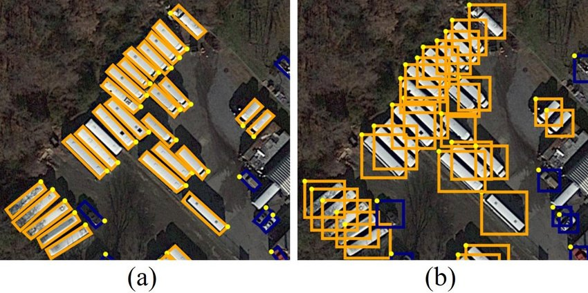

## Результат

- https://www.kaggle.com/code/arseniybelkov/combined/notebook - создание датасета
- https://www.kaggle.com/code/arseniybelkov/real-obb-detection/notebook - обучение модели  
- https://www.kaggle.com/code/arseniybelkov/real-obb-analysis/notebook - inference
- https://www.kaggle.com/code/arseniybelkov/hidden-real-obb-analysis/notebook - inference на отложенном тесте

Для воспроизведения результатов надо просто зайти в ноутубк real-obb-detection, нажать run all. Подождать конца обучения, после чего запустить obb-analysis (перед этим лучше обновить obb-detection во вкладке Input).    

### Модель

Для детекции OBB была использована модель [YOLOv8 от Ultralytics](https://docs.ultralytics.com/tasks/obb/). Модель была выбрана, т.к. ее запуск осуществлялся проще всего, минорные различия в архитектурах (наличие attention, другие виды сверток и тд) с другими моделями я считаю не самыми важными для качества.  
Список отреджекченных моделей:  
- https://github.com/qinr/MRDet (requires cuda compiling)
- https://github.com/Ixiaohuihuihui/AO2-DETR (also requires cuda compiling)
- https://www.researchgate.net/publication/377163595_HODet_A_New_Detector_for_Arbitrary-Oriented_Rectangular_Object_in_Optical_Remote_Sensing_Imagery (no code provided)
- https://github.com/jbwang1997/OBBDetection (also requires cuda compiling)  

На выходе модель дает список боксов с конфиденсами, боксы в формате xyxyxyxy (координаты коробки)  

К сожалению, Ultralytics не объясняют как они модифицорвали YOLO, что бы она работала с OBB. Все что нам оставили - эта картинка:  
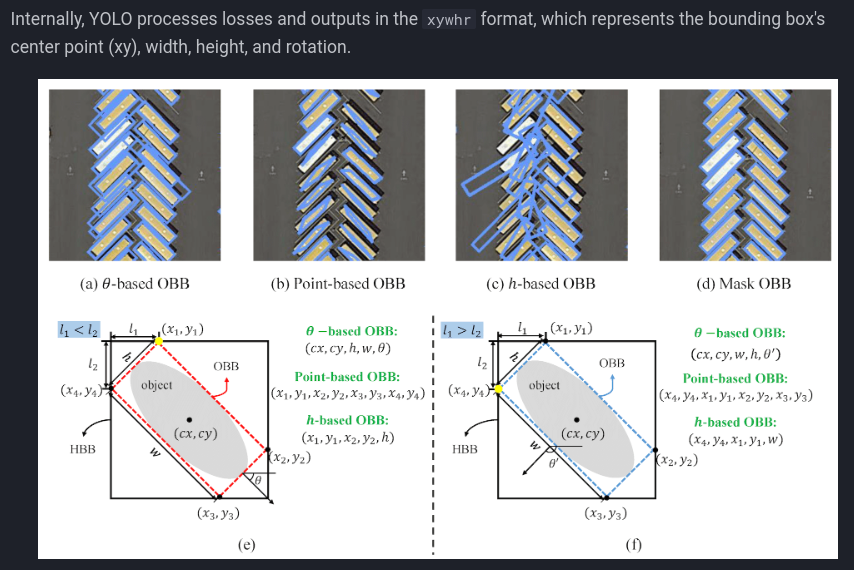

По всей видимости они просто модициировали лосс функцию.  
Архитектура YOLOv8:
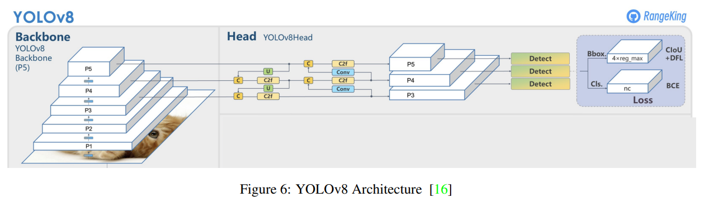

### Датасет

В датасете использовались данные, собранные нами, открытый датасет с Kaggle и сгенерированные данные.
Размер Kaggle датасета составляет 167 картинок, размер собранного нами датасет составляет 177 картинок, итого из реальных данных для обучения, валидации, и теста модели используется 344 картинок.  

Все картинки были зарескейленены к шейпу 1000x1000

Колличество сгенерированных данных в выборке подвластно нам во всех смыслах, поэтому % содержания синтетики подвергся ресерчу (о нем позже).  

Для генерации данных использовался код Всеволода Плохотнюка (немного измененный и исправленный). Примеры:  
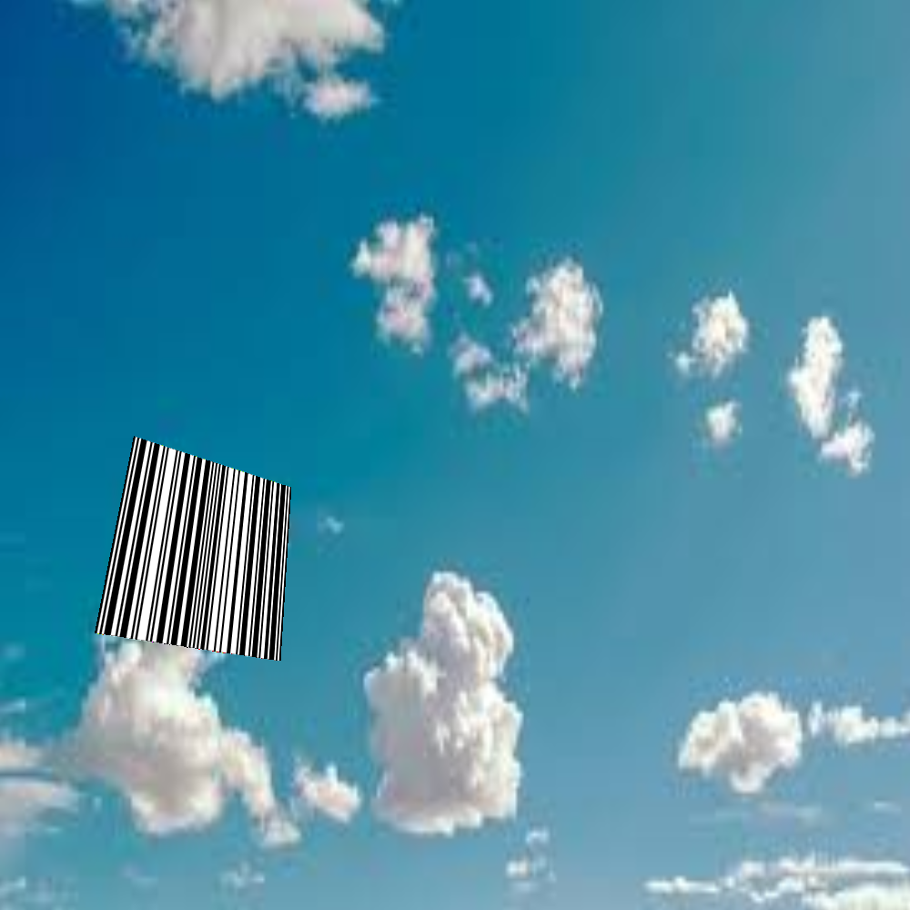
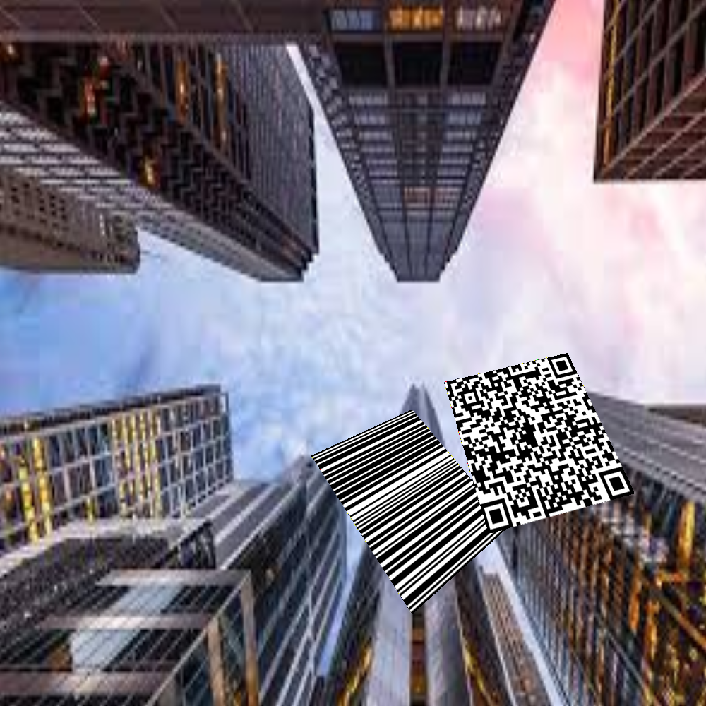
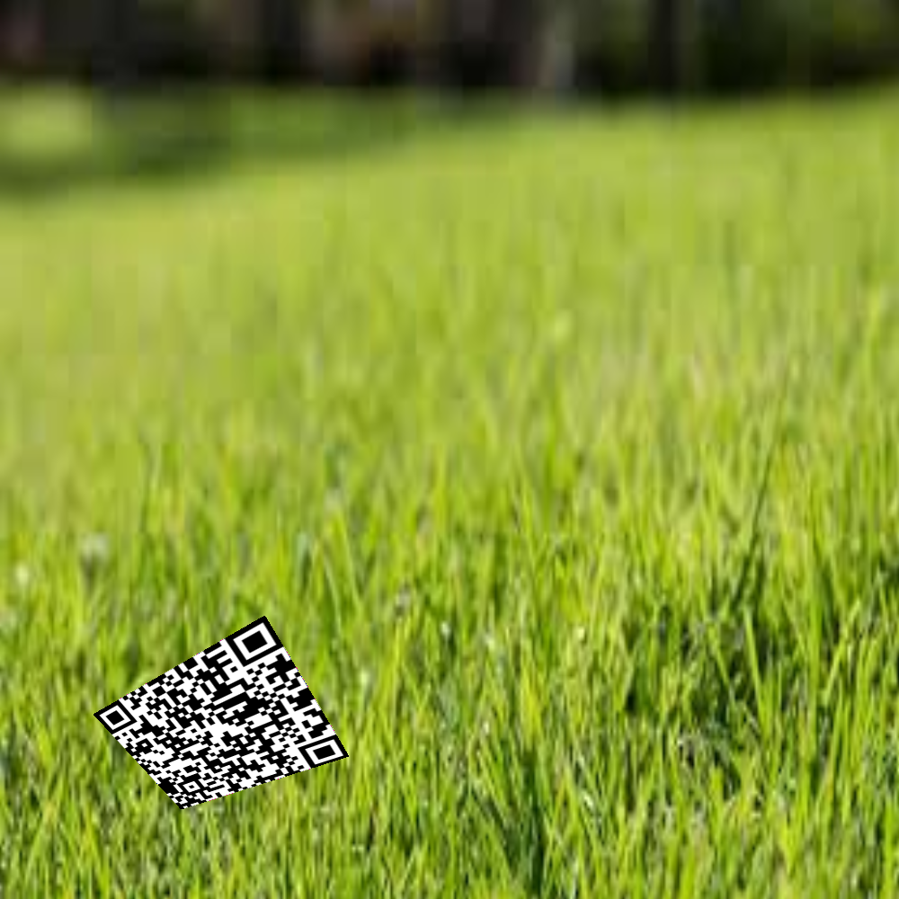

На рандомную картинку просто наклеивались коды. 

#### Подготовка данных
Были написаны скрипты для трансформации нашей и внешней разметки в необходимую для обучения и валидации YOLO.  
Наша разметки осуществлялась полигонами по контуру баркода. Один из ноутбуков, [осуществляющий преобразовние контура в OBB](https://www.kaggle.com/arseniybelkov/ours-private).  
К сожалению, на некоторых картинках была разметка с ошибками, поэтому ~5 кейсов пришлось выкинуть.  
Пример неправильной разметки:  
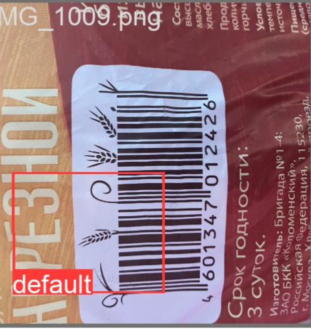  

Препарация внешних данных происходила по похожему рецепту, за исключением того, что внешние данные размечены под сегменатцию.  
Преобразование сегменатционной маски можно осуществить следующими преобразованиями: находим связные компоненты маски -> для каждой связной компоненты находим контур -> как и в предыдущем пункте используем cv2.minAreaRect для нахождения OBB.  

Опять же, К СОЖАЛЕНИЮ, маски не всегда сделаны качественно. В них есть дыры, лишние маленькие связные компоненты, которые результируются в лишних контурах и как следствие в лишних боксах. Фильтрацию таких экземпляров была проведена след. образом: У каждой связной компоненты делаем диляцию (binary dilation, что бы убрать дыры), после чего отсеиваем все компоненты которые в 10 раз меньше наибольшей. 
Пример результатов плохой маски:  
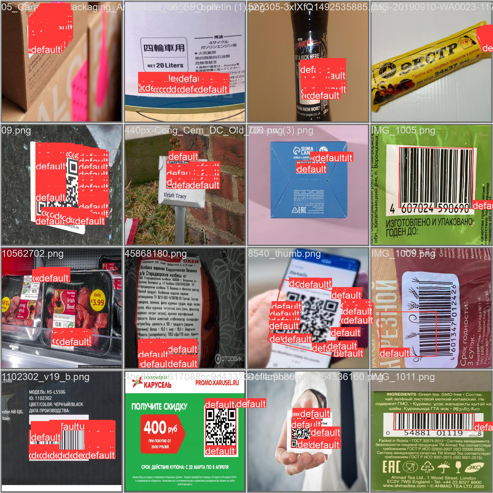
Каждая надпись `default` означает OBB.

### Лосс и Метрики
В качестве лосс функции используется [ванильный лосс yolov8](https://arxiv.org/abs/2305.09972) (i.e. MSE между боксами + CE для классификации + DFL loss (CE между IoU)), как-то (?) модифицированный под OBB.  
В качестве валидационных и тестовых метрик использовались следующие величины: [Dice-Score](https://en.wikipedia.org/wiki/Dice-S%C3%B8rensen_coefficient), [Recall, Precision](https://en.wikipedia.org/wiki/Precision_and_recall), [Hausdorff Distance](https://en.wikipedia.org/wiki/Hausdorff_distance).  
Вычислялись метрики следующим образом (для одной картинки):  
- Из модели выходил список боксов и конфиденсов.
- Для вычисления Dice Score, Precision and Recall, все боксы заливались, тем самым мы получали бинарную маску предикта. Метрики считались между бинарной маской предикта, и полученной таким же образом бинарнйо маской таргета.
- Для вычисления Hausdorff Distance боксы предикта и таргета превращались в контуры. Из-за того что мы не знаем соответсвия между предиктнутыми и таргетными боксами, HD вычислялась след. образом:
  1. Для каждого target_contour находился predict_contour с наименьшей HD, без повторений predict_contour. Если кол-во предиктов было меньше чем кол-во таргетов, HD присваивалось значение 100.  
  2. Составлялся список полученных HD
  3. Для метрик брались min, max и mean статистики.

### Эксперименты
Сплит данных осуществился след образом: В нашем датасете присутствуют фотографии с 3 телефонов + каггл датасет, итого у нас 4 "домена". В фолдах `train`, `val`, `test` сохраняются пропорции между доменами.
Соотношение между train/val/test = 0.6/0.3/0.1, с учетом того что в выборке 344 картинки, получаем 206 / 104 / 34.

Первые эксперименты проводились на неочищенных (как было показано выше) данных и без наличия синтетики.   
Результаты на тесте:  
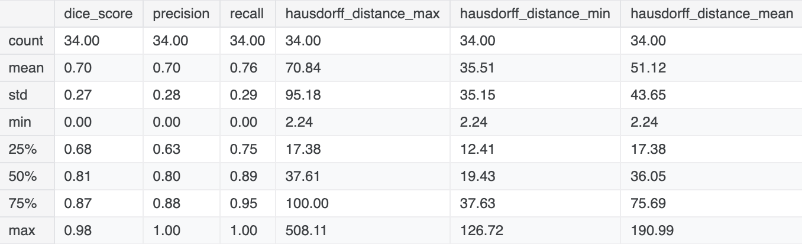

После чего была проведена чистка данных. Метрики на тесте: 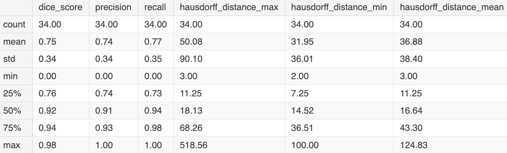

На этом моменте были подобраны гиперпараметры пооптимальнее, так же были подключены аугментации для GaussianBlur и ColorJitter, RandomRotation, RandomPerspective, RandomBrightnessContrast, метрики немного подросли.  
Примеры аугментаций:  
Оригинальная картинка:  
  
Аугментированные:  

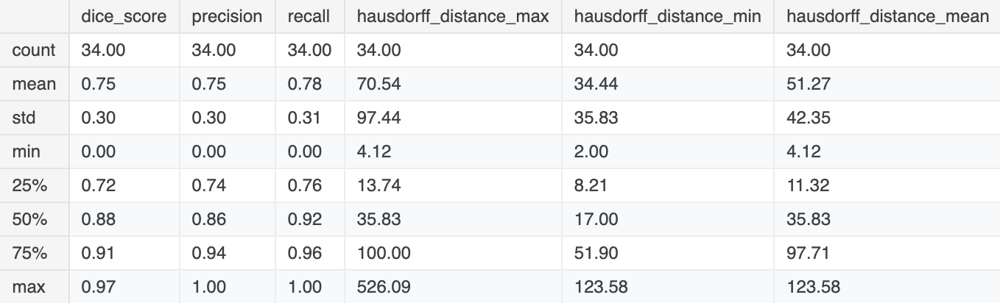

После этого начинаем инъекции синтетики в наши данные: 
График зависимости Dice Score от % синтетики в трейне:  

Можно заметить, что метрика не значительно убывает, поэтому оставим 10% содержание.  
Тест метрики для 10% содержания:  
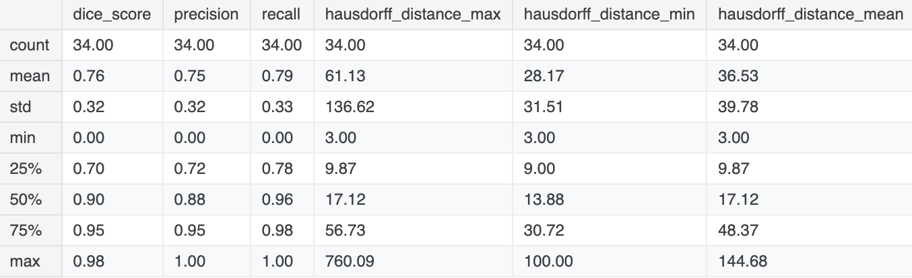

(Кстати можно заметить что Хаусдорф уменьшился - это хорошо).

Внизу [этого ноутбука](https://www.kaggle.com/code/arseniybelkov/real-obb-analysis) можно найти вышеуказанную табличку с метриками, а так же per-case метрики.  
Во вкладке [Output](https://www.kaggle.com/code/arseniybelkov/real-obb-analysis/output) можно посмотреть на предикты на тесте.

### Финальная Эвалюация
Для финальной проверки модели, я разметил 44 картинки со своего телефона. Фотографии с моего телефона модель еще не видела, так что для нее мы можем считать это новым доменом + там много фоток с физтеха, которых в датасете не было.
Примеры фотографий:  
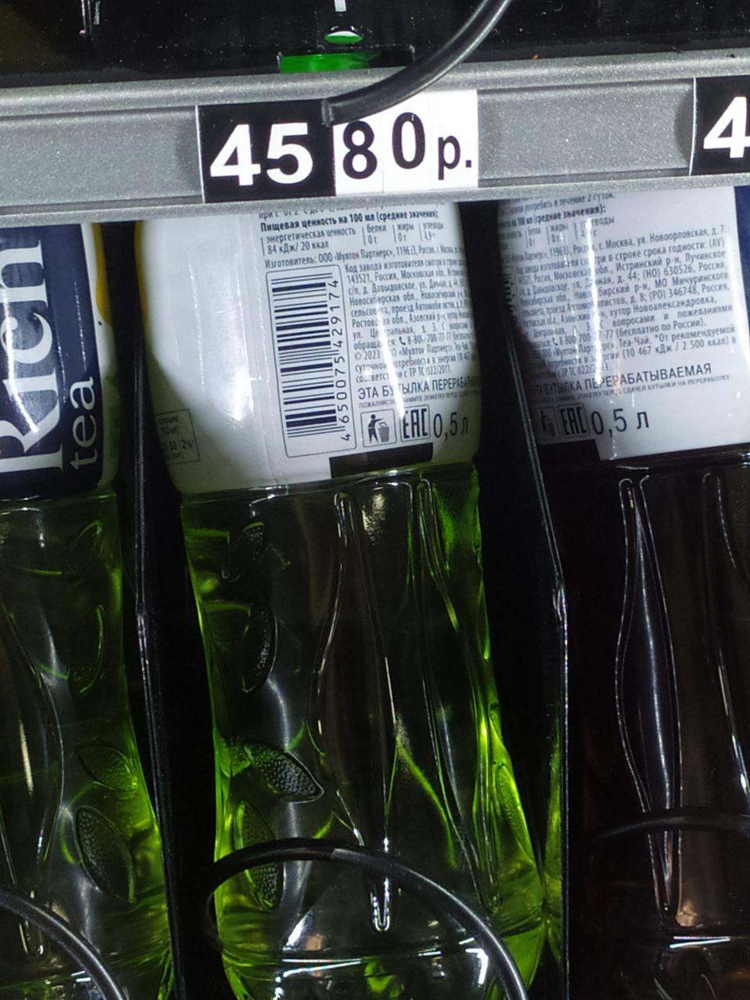
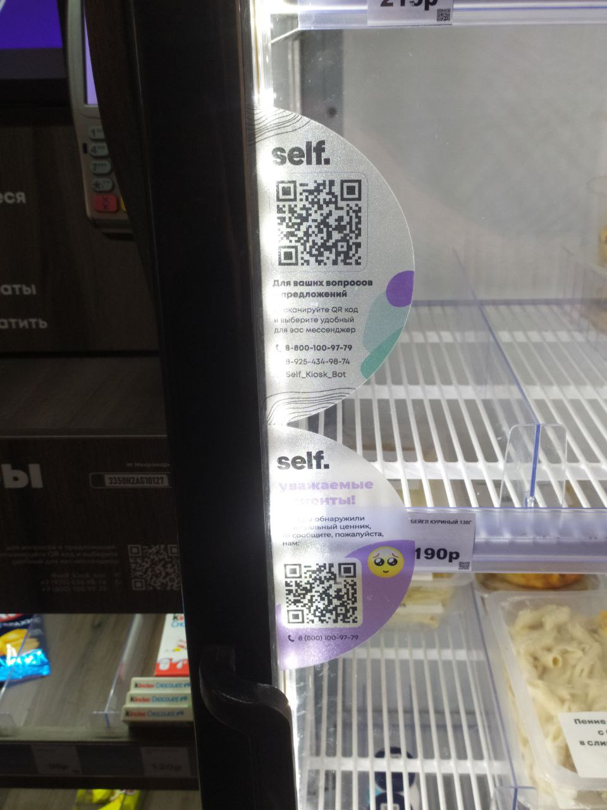
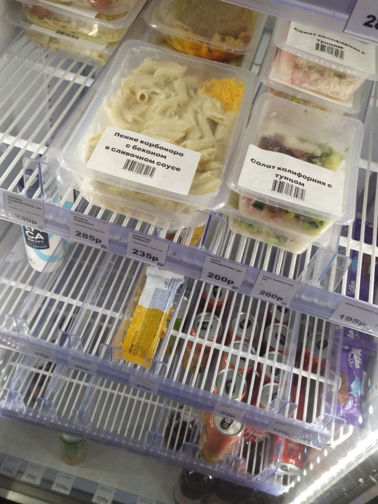

Пример предикта:
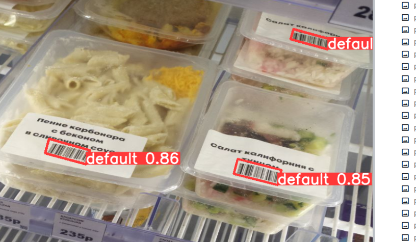

Метрики:
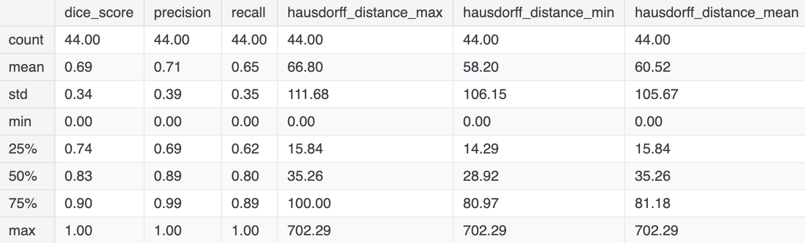

Внизу [этого ноутбука](https://www.kaggle.com/code/arseniybelkov/hidden-real-obb-analysis) можно найти вышеуказанную табличку с метриками, а так же per-case метрики.  
Во вкладке [Output](https://www.kaggle.com/code/arseniybelkov/hidden-real-obb-analysis/output) можно посмотреть на предикты на всем моем отложенном тесте. 

### Повышение качества
Основным средством повышения качества будет дальнейшая чистка / переразметка выборки, так как придуманные мной эвристики скорее всего не вычистили все кейсы.  

### Инфраструктура
Для обучения и подготовки данных я использовал Kaggle. После написание довольно большого кол-ва ноутбуков, средства этой платформы позволяют добавлять новые данные и перезапускать эсперименты в течении нескольких минут, платформа сама подтягивает изменения из всех залинкованных ноутбуков. Это позволяет существенно сократить время между итерациями.

## 13-05-2024 (prefinale)  

## Task
Была поставлена задача обучить OBB detection модель на снимках с баркодами для детекции этих самых баркодов.

## Results

- https://www.kaggle.com/code/arseniybelkov/more-real-barcodes/notebook - создание датасета
- https://www.kaggle.com/code/arseniybelkov/obb-detection/notebook - обучение модели  
- https://www.kaggle.com/code/arseniybelkov/obb-analysis/notebook - inference

Для воспроизведения результатов надо просто зайти в ноутубк obb-detection, нажать run all. Подождать конца обучения, после чего запустить obb-analysis (перед этим лучше обновить obb-detection во вкладке Input).  
Ноутбук с созданием датасета лучше не запускать, тк там не зафиксированы сиды и данные поменяются.  

### Model

Для детекции OBB была использована модель [YOLOv8 от Ultralytics](https://docs.ultralytics.com/tasks/obb/). Модель была выбрана, т.к. ее запуск осуществлялся проще всего, минорные различия в архитектурах (наличие attention, другие виды сверток и тд) с другими моделями я считаю не самыми важными для качества.  
Список отреджекченных моделей:  
- https://github.com/qinr/MRDet (requires cuda compiling)
- https://github.com/Ixiaohuihuihui/AO2-DETR (also requires cuda compiling)
- https://www.researchgate.net/publication/377163595_HODet_A_New_Detector_for_Arbitrary-Oriented_Rectangular_Object_in_Optical_Remote_Sensing_Imagery (no code provided)
- https://github.com/jbwang1997/OBBDetection (also requires cuda compiling)  

На выходе модель дает список боксов с конфиденсами, боксы в формате xyxyxyxy (координаты коробки)  

 
Полученные метрики и предикты на тесте:  
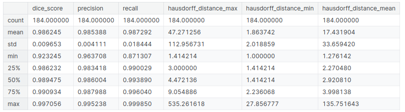
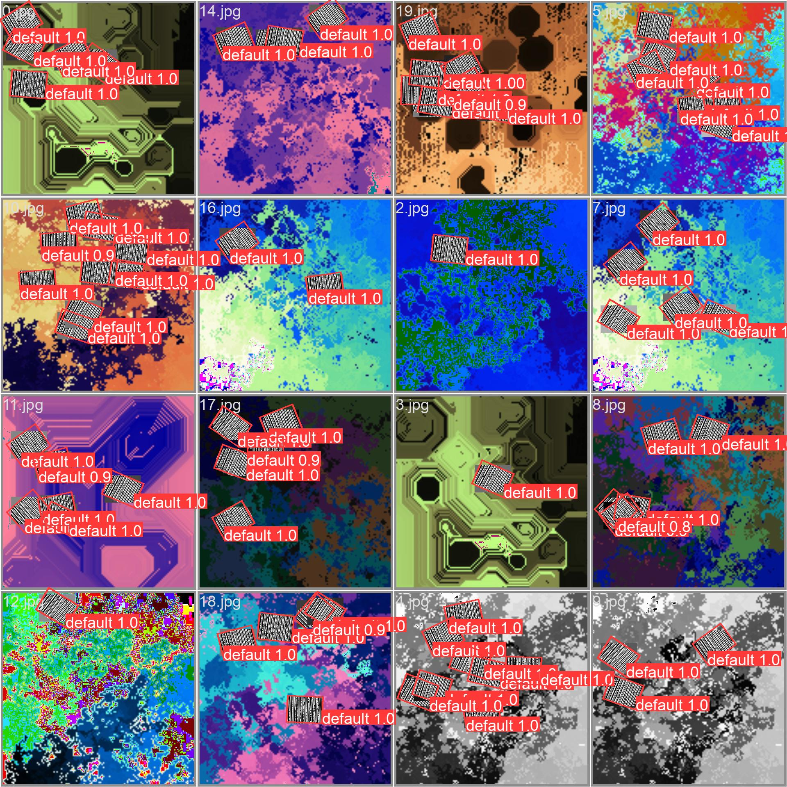

Модель ошибается на кейсах с сильно налезшмим друг на друга кодами, но в случаех почти полного перекрытия ничего сделать скорее всего и не получиться.  

## 22-04-2024
- https://www.kaggle.com/code/arseniybelkov/obb-detection/notebook - обучение модели  
- https://www.kaggle.com/code/arseniybelkov/obb-analysis/notebook - inference  
Модель за 16.04 провалилась (были ошибки в создании датасета), сейчас ошибки пофикшены, модель обучилась на 1000 снимков (коды на черном фоне повернутые на разный угол).
Кривые на валидации + фотки предиктов:
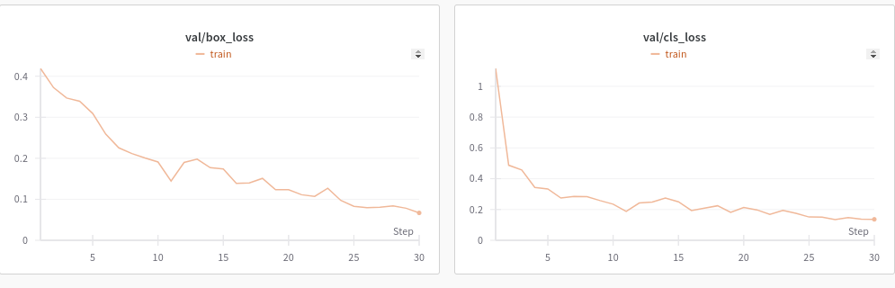  
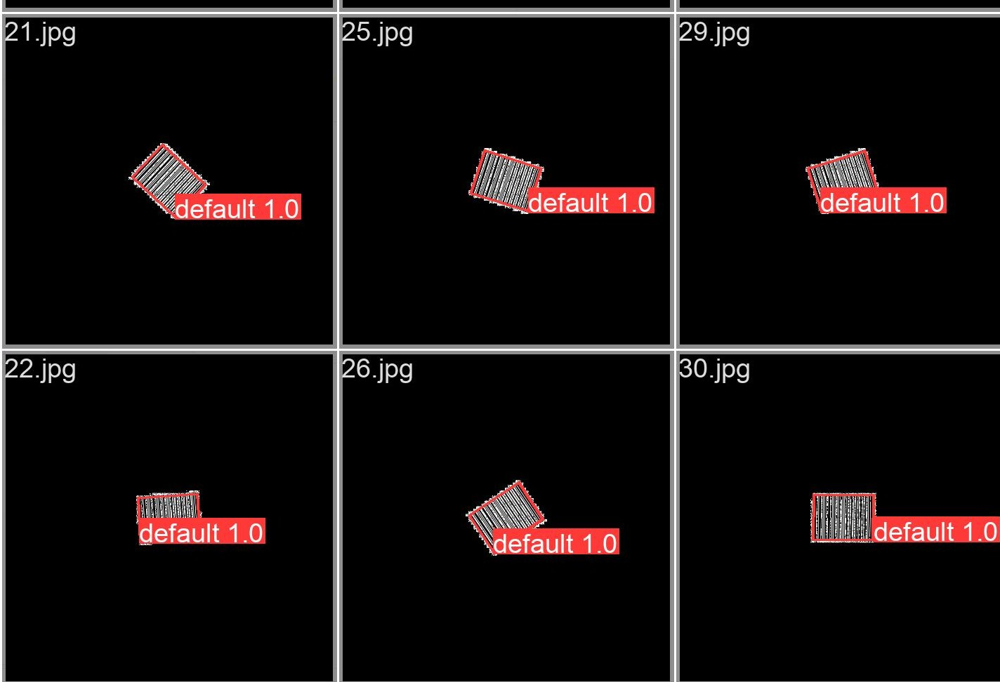  

Next steps (from high to low priority):  
- рандомный фон + сдвиг кодов от центра (не должно усложнить тренировку, сейчас не готово, потому что надо было сильно переписать код генерации) 
- больше 1 кода на картинке
- прочие дисторшны (чем больше аугмов - тем больше жрем гпу, на каггле будет проблема)

## 16-04-2024
- https://www.kaggle.com/code/arseniybelkov/obb-detection/notebook?scriptVersionId=172346702 - модель обучается  
Взял [модель](https://docs.ultralytics.com/tasks/obb/#train) от [ultralytics](https://github.com/ultralytics/ultralytics), выбирал по принципу "легче всего запустить".
Сейчас она учится на grayscale картинках с искаженными баркодами, по одному коду на картинку, интенсивность фона - рандомная. 
## 27-03-2024
- https://www.kaggle.com/code/arseniybelkov/barcodes - каггл ноутубук с генерацией данных (needs to be thorougly tested ofc)

## 20-03-2024
Поставили задачу rotated rectangles detection  
- Tasks:
  - Архитектура,метрики и лосс функции (https://arxiv.org/pdf/2012.13135.pdf, https://arxiv.org/pdf/2205.12785.pdf, [RG](https://www.researchgate.net/publication/377163595_HODet_A_New_Detector_for_Arbitrary-Oriented_Rectangular_Object_in_Optical_Remote_Sensing_Imagery), https://github.com/lilanxiao/Rotated_IoU, https://github.com/jbwang1997/OBBDetection)
  - __Данные (найти открытые / ждем генерацию), получить боксы__ - программа минимум на 27-03-2024
  - _Обучить на сгенеренных картинках (минимум - баркод на однородном фоне)_ - программа максимум  
- Проблемы:  
  - В выше указанных статьях объекты +- одного скейла, у нас же разница может быть довольно большой (тут мб нас спасет Unet-like, или DETR)
  - Для квадратных qr-ов поворот не существеннен, для вытянутых существеннен
