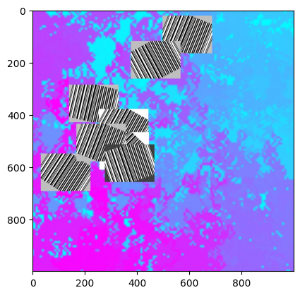
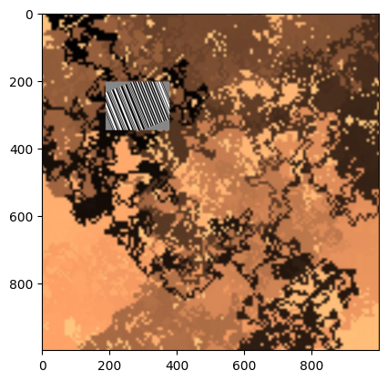

# iitp-modern-cv

Арсений Белков, М01-301

IITP course on modern Computer Vision
## 13-05-2024 (finale)  

## Task
Была поставлена задача обучить OBB detection модель на снимках с баркодами

## Results

- https://www.kaggle.com/code/arseniybelkov/more-real-barcodes/notebook - создание датасета
- https://www.kaggle.com/code/arseniybelkov/obb-detection/notebook - обучение модели  
- https://www.kaggle.com/code/arseniybelkov/obb-analysis/notebook - inference

Для воспроизведения результатов надо просто зайти в ноутубк obb-detection, нажать run all. Подождать конца обучения, после чего запустить obb-analysis (перед этим лучше обновить obb-detection во вкладке Input).  
Ноутбук с созданием датасета лучше не запускать, тк там не зафиксированы сиды и данные поменяются.  

### Model

Для детекции OBB была использована модель [YOLOv8 от Ultralytics](https://docs.ultralytics.com/tasks/obb/). Модель была выбрана, т.к. ее запуск осуществлялся проще всего, минорные различия в архитектурах (наличие attention, другие виды сверток и тд) с другими моделями я считаю не самыми важными для качества.  
Список отреджекченных моделей:  
- https://github.com/qinr/MRDet (requires cuda compiling)
- https://github.com/Ixiaohuihuihui/AO2-DETR (also requires cuda compiling)
- https://www.researchgate.net/publication/377163595_HODet_A_New_Detector_for_Arbitrary-Oriented_Rectangular_Object_in_Optical_Remote_Sensing_Imagery (no code provided)
- https://github.com/jbwang1997/OBBDetection (also requires cuda compiling)

### Dataset

Датасет был сгенерирован, используя код Всеволода Плохотнюка для генерации самих баркодов. Коды были повернуты на рандомный угол и наклеены на рандомный фон. Примеры данных:  

  

Выборка состоит из ~2000 картинок для трейна, 200 для валидации и 180 для теста.  

### Loss function & Metrics
В качестве лосс функции используется [ванильный лосс yolov8](https://arxiv.org/abs/2305.09972) (i.e. MSE между боксами + CE для классификации + DFL loss (CE между IoU)).  
В качестве валидационных и тестовых метрик использовались следующие величины: [Dice-Score](https://en.wikipedia.org/wiki/Dice-S%C3%B8rensen_coefficient), [Recall, Precision](https://en.wikipedia.org/wiki/Precision_and_recall), [Hausdorff Distance](https://en.wikipedia.org/wiki/Hausdorff_distance).  
Вычислялись метрики следующим образом (для одной картинки):  
- Из модели выходил список боксов и конфиденсов.
- Часть боксов отсеивалась по конфиденсу > 0.3.
- Для вычисления Dice Score, Precision and Recall, все боксы заливались, тем самым мы получали бинарную маску предикта. Метрики считались между бинарной маской предикта, и полученной таким же образом бинарнйо маской таргета.
- Для вычисления Hausdorff Distance боксы предикта и таргета превращались в контуры. Из-за того что мы не знаем соответсвия между предиктнутыми и таргетными боксами, HD вычислялась след. образом:
  1. Для каждого target_contour находился predict_contour с наименьшей HD, без повторений predict_contour. Если кол-во предиктов было меньше чем кол-во таргетов, HD присваивалось значение 100.  
  2. Составлялся список полученных HD
  3. Для метрик брались min, max и mean статистики.
 
Полученные метрики и предикты на тесте:  

Модель ошибается на кейсах с сильно налезшмим друг на друга кодами, но в случаех почти полного перекрытия ничего сделать скорее всего и не получиться.  

## 22-04-2024
- https://www.kaggle.com/code/arseniybelkov/obb-detection/notebook - обучение модели  
- https://www.kaggle.com/code/arseniybelkov/obb-analysis/notebook - inference  
Модель за 16.04 провалилась (были ошибки в создании датасета), сейчас ошибки пофикшены, модель обучилась на 1000 снимков (коды на черном фоне повернутые на разный угол).
Кривые на валидации + фотки предиктов:
  
  

Next steps (from high to low priority):  
- рандомный фон + сдвиг кодов от центра (не должно усложнить тренировку, сейчас не готово, потому что надо было сильно переписать код генерации) 
- больше 1 кода на картинке
- прочие дисторшны (чем больше аугмов - тем больше жрем гпу, на каггле будет проблема)

## 16-04-2024
- https://www.kaggle.com/code/arseniybelkov/obb-detection/notebook?scriptVersionId=172346702 - модель обучается  
Взял [модель](https://docs.ultralytics.com/tasks/obb/#train) от [ultralytics](https://github.com/ultralytics/ultralytics), выбирал по принципу "легче всего запустить".
Сейчас она учится на grayscale картинках с искаженными баркодами, по одному коду на картинку, интенсивность фона - рандомная. 
## 27-03-2024
- https://www.kaggle.com/code/arseniybelkov/barcodes - каггл ноутубук с генерацией данных (needs to be thorougly tested ofc)

## 20-03-2024
Поставили задачу rotated rectangles detection  
- Tasks:
  - Архитектура,метрики и лосс функции (https://arxiv.org/pdf/2012.13135.pdf, https://arxiv.org/pdf/2205.12785.pdf, [RG](https://www.researchgate.net/publication/377163595_HODet_A_New_Detector_for_Arbitrary-Oriented_Rectangular_Object_in_Optical_Remote_Sensing_Imagery), https://github.com/lilanxiao/Rotated_IoU, https://github.com/jbwang1997/OBBDetection)
  - __Данные (найти открытые / ждем генерацию), получить боксы__ - программа минимум на 27-03-2024
  - _Обучить на сгенеренных картинках (минимум - баркод на однородном фоне)_ - программа максимум  
- Проблемы:  
  - В выше указанных статьях объекты +- одного скейла, у нас же разница может быть довольно большой (тут мб нас спасет Unet-like, или DETR)
  - Для квадратных qr-ов поворот не существеннен, для вытянутых существеннен
